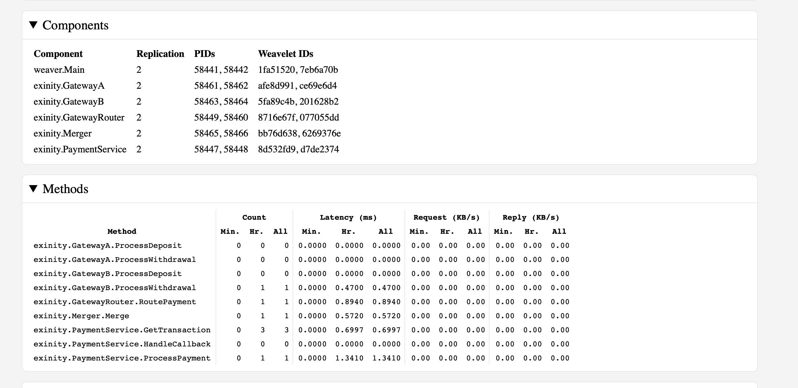

# Specs and Design Decisions

## How did i write this program

- I thought of going with multiple services and using docker compose to manage all of that
- A monolithic architecure was intuitive to implmenet and also manage within the timeframe
- The escrow integration is really common to me, I have implemented it multiple times with central banks, service providers, mobile money etc
- In go, two frameworks I knew for building microservices are:
  - go-kit
  - and service weaver (i read its announcement on hacker news and I loved its approach, but that was a year ago)
- I started with building regular functions for withdrawals and deposits, and a callback to update the transaction status. We used Safe Map for safe concurrent access (multiple readers, rare writes)
- service weaver was not intrusive to integrate, since the same methods stayed largerly intact


## Specs
- we are tasked to build a microservices payment processor, the idea is to demonstrate a complex financial system and the operation that happens inside it.
- gateway_a will accept json over http for withdrawal and deposts

This program illustrates a simple financial system with different moving parts. We have these components:
- withdrawal and deposit services (also status and callback)
- we have payment processor service
- we also have a routing service


## Some design decisions
- shared backing storage for both gateway_a and gateway_b, our idea was to simplify the program due to time constraints
- shared storage also meant that both gateway_a and gateway_b can be used to make withdral and deposit requests, using json
- callback when used with gateway_a accepts json, when called via gateway_b it only accepts XML
- we also made a transaction status api to inquire about a transaction status, this is to implement the full flow: make a transaction, a callback updates its status, and finally check that the status matches the updated value.
- retrials and autoscaling are implemented by the service weaver runtime: service weaver can automatically scale up and down based on the load, and it also uses kubernetes horizontal pod autoscaler

### Notes of service weaver 
- service weaver supports single and multi deployment
- service weaver components, eg. `tx, err := a.paymentService.Get().GetTransaction(r.Context(), id)` might be in process calls, or remote procedure calls -- depending on the deployment!
- for rpc calls, service weaver will retry the call
- for idempotent methods, we need to care about that. A simpler approach might be to `var _ weaver.NotRetriable = Merger.Merge` -- we demonstrated that in merger component


## Interesting behavior

```sh
➜  iso git:(main) ✗ curl -X POST http://localhost:8080/withdrawal \                                      
     -H "Content-Type: application/json" \
     -d '{"amount": 50.0, "gateway": "gateway_b"}' -v
Note: Unnecessary use of -X or --request, POST is already inferred.
* Host localhost:8080 was resolved.
* IPv6: ::1
* IPv4: 127.0.0.1
*   Trying [::1]:8080...
* connect to ::1 port 8080 from ::1 port 59444 failed: Connection refused
*   Trying 127.0.0.1:8080...
* Connected to localhost (127.0.0.1) port 8080
> POST /withdrawal HTTP/1.1
> Host: localhost:8080
> User-Agent: curl/8.6.0
> Accept: */*
> Content-Type: application/json
> Content-Length: 40
> 
< HTTP/1.1 200 OK
< Content-Length: 213
< Content-Type: application/json
< Date: Sat, 17 Aug 2024 11:17:45 GMT
< 
{"ID":"d228f7aa-a691-42ad-b173-ad0461febabb","Amount":50,"Type":"withdrawal","Status":"pending","Gateway":"gateway_b","CreatedAt":"2024-08-17T14:17:45.562589+03:00","UpdatedAt":"2024-08-17T14:17:45.562589+03:00"}
* Connection #0 to host localhost left intact
➜  iso git:(main) ✗ curl -X GET http://localhost:8080/transaction/d228f7aa-a691-42ad-b173-ad0461febabb \ 
     -H "Content-Type: application/json" \
     -d '{"status": "failed", "transaction_id": "571c02a4-e6fe-4743-afc2-6e4f9af66891"}'

transaction not found
➜  iso git:(main) ✗ curl -X GET http://localhost:8080/transaction/d228f7aa-a691-42ad-b173-ad0461febabb \
     -H "Content-Type: application/json" \
     -d '{"status": "failed", "transaction_id": "571c02a4-e6fe-4743-afc2-6e4f9af66891"}'

transaction not found
➜  iso git:(main) ✗ curl -X GET http://localhost:8080/transaction/d228f7aa-a691-42ad-b173-ad0461febabb \
     -H "Content-Type: application/json" \
     -d '{"status": "failed", "transaction_id": "571c02a4-e6fe-4743-afc2-6e4f9af66891"}'

{"ID":"d228f7aa-a691-42ad-b173-ad0461febabb","Amount":50,"Type":"withdrawal","Status":"pending","Gateway":"gateway_b","CreatedAt":"2024-08-17T14:17:45.562589+03:00","UpdatedAt":"2024-08-17T14:17:45.562589+03:00","XMLResponse":"i am xml response"}
➜  iso git:(main) ✗ 
```

Since weaver replicates the program (2 replicas on local multi-deployment); you can see that sometimes it fails to retrieve the transaction. Since the transaction is saved in-memory, and the routing of the requests is managed by the service weaver runtime, we end up creating an operaiton in one process, and trying to update it in a different process.



## apis 

- the apis were made to be extremely simple and compact. Just parsing the request and passthrough to the service.
- we have consciously made /callback/{gateway} with gateway in url params, while this diverges from the other (withdrawal, deposit) apis, it is a design decision to make it more explicit.
- the logic for xml / json termination, while could be at the handler level, I thought it should be hidden from this layer:
    - i don't want to encourage other collaborators to update the api, since that will inadvertenly lead to breaking our API with our consumers
    - i also believe that this logic should be delegated to the payment service layer, as oppose to the handler layer